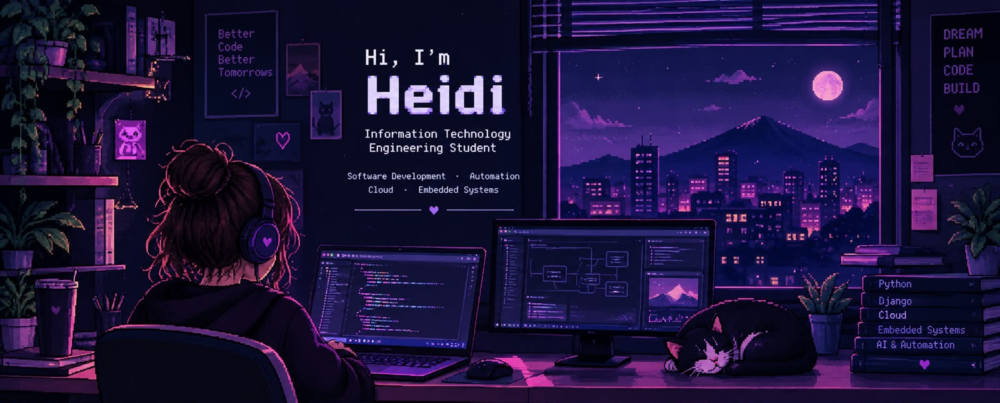

  <!-- Cambia header.jpg por el enlace real de tu imagen -->
  

  <a href="https://git.io/typing-svg">
    <!-- El parámetro font=VT323 usa una fuente pixel art real -->
    +INIT_SYSTEM...;>+IT_ENGINEERING_STUDENT;>+BACKEND_AND_AUTOMATION;>+SEEKING_2027_INTERNSHIP;>+HELLO_WORLD_!" alt="Typing SVG" />
  </a>

  <code>Passionate about building scalable software and automating workflows.</code> 
  <code>Specializing in backend architecture, databases, and practical tech solutions.</code>

  

  <h2><code>/ / &nbsp; T E C H N O L O G I E S &nbsp; / /</code></h2>

 

  
  
  
  
  
  
    
  
  
  
  
  

  

  <h2><code>/ / &nbsp; P R O J E C T S &nbsp; / /</code></h2>

 

> <code><b>[1] Service Desk Chatbot</b></code>
>  <code>Automated WhatsApp technical support chatbot for IT ticket management.</code>
>  <code>> Stack: n8n | PostgreSQL | REST API | Azure OpenAI</code>

> <code><b>[2] Django Web Application</b></code>
>  <code>Structured data management web app backed by a secure relational DB.</code>
>  <code>> Stack: Python | Django | SQL | HTML | CSS</code>

> <code><b>[3] 2D Platformer Game</b></code>
>  <code>Interactive 2D platforming game featuring complex level design & state.</code>
>  <code>> Stack: Unity | C#</code>

> <code><b>[4] Embedded Robotics</b></code>
>  <code>Hardware integration projects using microcontrollers and sensors.</code>
>  <code>> Stack: ESP32 | Arduino | C++</code>

  

  <h2><code>/ / &nbsp; S T A T S &nbsp; / /</code></h2>

 

  <!-- Replace YOUR_GITHUB_USERNAME in BOTH links below -->
  
  

  

  
  

